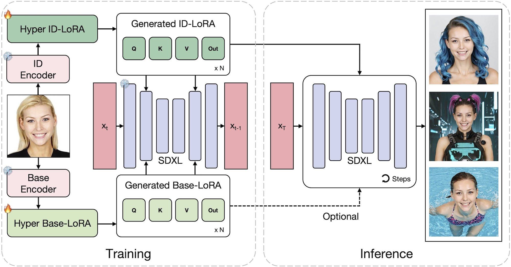

<h1 style="text-align: center">[CVPR 2025] HyperLoRA: Parameter-Efficient Adaptive Generation for Portrait Synthesis</h1>
<div style="text-align: center">
    <a href="https://lemonsky1995.github.io/" target="_blank">Mengtian Li</a><sup>*</sup>,
    <a href="https://openreview.net/profile?id=~Jinshu_Chen2" target="_blank">Jinshu Chen</a><sup>*</sup>,
    <a href="https://wanquanf.github.io/" target="_blank">Wanquan Feng</a><sup>*✉</sup>,
    <a href="https://scholar.google.com/citations?user=ac5Se6QAAAAJ" target="_blank">Bingchuan Li</a>,
    <a href="https://openreview.net/profile?id=~Fei_Dai1" target="_blank">Fei Dai</a>,
    <a href="https://openreview.net/profile?id=~Songtao_Zhao1" target="_blank">Songtao Zhao</a>,
    <a href="https://scholar.google.com/citations?user=9rWWCgUAAAAJ" target="_blank">Qian He</a>
</div>
<br>
<div style="text-align: center; font-size: 120%">
    [<a href="https://lemonsky1995.github.io/hyperlora/" target="_blank">Project Page</a>]
    [<a href="https://arxiv.org/abs/2503.16944" target="_blank">ArXiv</a>]
</div>

## Abstract
Personalized portrait synthesis, essential in domains like social entertainment, has recently made significant progress. Person-wise fine-tuning based methods, such as LoRA and DreamBooth, can produce photorealistic outputs but need training on individual samples, consuming time and resources and posing an unstable risk. Adapter based techniques such as IP-Adapter freeze the foundational model parameters and employ a plug-in architecture to enable zero-shot inference, but they often exhibit a lack of naturalness and authenticity, which are not to be overlooked in portrait synthesis tasks. In this paper, we introduce a parameter-efficient adaptive generation method, namely HyperLoRA, that uses an adaptive plug-in network to generate LoRA weights, merging the superior performance of LoRA with the zero-shot capability of adapter scheme. Through our carefully designed network structure and training strategy, we achieve zero-shot personalized portrait generation (supporting both single and multiple image inputs) with high photorealism, fidelity, and editability.

## Overview

We explicitly decompose the HyperLoRA into a Hyper ID-LoRA and a Hyper Base-LoRA. The former is designed to learn ID information while the latter is expected to fit others, e.g. background and clothing. Such a design helps to prevent irreverent features leaking to ID-LoRA. During the training, we fix the weights of the pretrained SDXL base model and encoders, allowing only HyperLoRA modules updated by Backpropagation. At the inference stage, the Hyper ID-LoRA integrated into SDXL generates personalized images while the Hyper Base-LoRA is optional.

## Usage
We are cleaning up our repo. The inference code and pretrained model are coming soon!

## Citation
If you find HyperLoRA useful in your research, please kindly cite our paper:
```bibtex
@article{li2025hyperlora,
    title={HyperLoRA: Parameter-Efficient Adaptive Generation for Portrait Synthesis}, 
    author={Mengtian Li and Jinshu Chen and Wanquan Feng and Bingchuan Li and Fei Dai and Songtao Zhao and Qian He},
    journal={arXiv preprint arXiv:2503.16944},
    year={2025}
}
```
